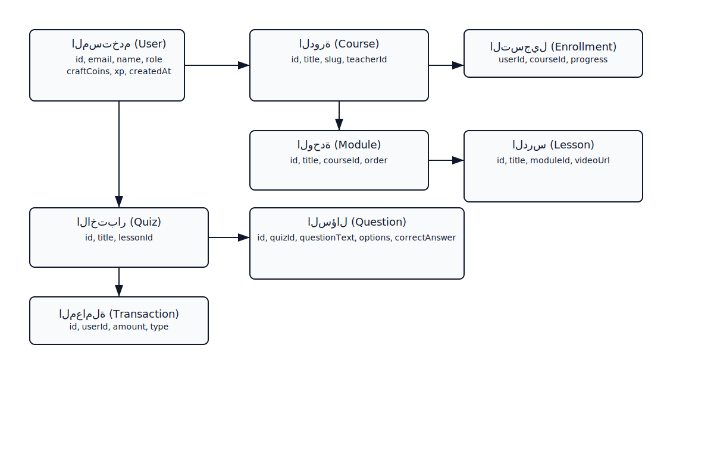
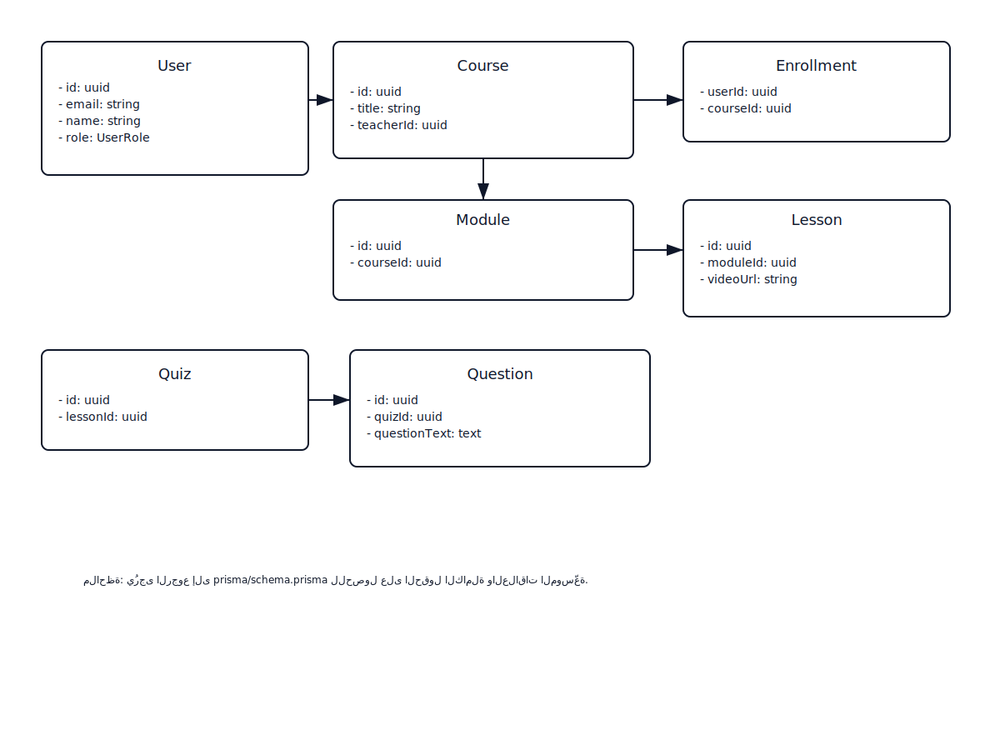

# تقرير معمارية ونماذج قاعدة البيانات - CodeCraft

> هذا المستند مُعدّ تلقائيًا لعرض معمارية المشروع والأدوات والمخططات ذات الصلة.

## ملخص تنفيذي

منصة تعليمية تفاعلية (Code Craft Core) مبنية باستخدام Next.js (App Router) وTypeScript، تعتمد على PostgreSQL مع Prisma كـ ORM، Supabase للمصادقة والتخزين، وتستخدم مكونات React وTailwind للواجهة. المستهدفون: طلاب ومعلمو البرمجة بالعربية وإداريّو المنصة.

## الأدوات والتقنيات المستخدمة ولماذا

- Next.js 16 (React 19): إطار عمل الواجهة والـ App Router لتقديم صفحات SSR/SSG وServer Actions.
- TypeScript: أمان نوعي للكود.
- Prisma + PostgreSQL: ORM قوي لتعريف المخطط وإدارة المهاجرات.
- Supabase: مصادقة وتخزين ملفات وSession management.
- Tailwind CSS: تصميم سريع وقابل للتخصي��.
- Zod: Validation للنماذج (input validation).
- bcrypt: تشفير كلمات المرور.
- Sentry (قابل للربط): للمراقبة والأخطاء.
- jwk/Rate limiting: حماية ضد الهجمات التكرارية (rate-limiter في lib).
- أدوات AI (مكتبات داخل lib/ai-*): لاقتراحات ومحتوى ذكي.

---

## شرح معماري النظام

- طبقة العميل (Client): مبنية بمكونات React تحت app/ تستخدم App Router. تتواصل مع الخادم عبر Server Actions وAPI routes الموجودة في app/api/*. تتعامل مع Supabase frontend SDK للمصادقة والتحميل.

- طبقة الخادم (Server): Next.js server (API routes + Server Actions). تستخدم Prisma client (lib/prisma.ts) للتواصل مع PostgreSQL. تتضمن خدمات مساعدة في lib/ (auth, rbac, rate-limiter, gamification, ai-*).

- قاعدة البيانات: PostgreSQL مصفوفة حسب prisma/schema.prisma — نماذج أساسية: User, Course, Module, Lesson, Enrollment, Quiz, Question, Transaction, AuditLog.

- تدفق البيانات: العميل يرسل طلبات عبر API/Server Actions → الخادم يتحقق (Zod, RBAC) → Prisma يتعامل مع DB → الخادم يرد بالنتيجة أو يستدع�� Supabase للتخزين.

---

## مخططات ERD (انظر الصورة SVG المرفقة)

(المخطط يوضح العلاقات الأساسية: User 1..* Enrollment → Course 1..* Module → Lesson; Quiz & Question; Transaction مرتبط بـ User)

---

## مخططات Class Diagram (SVG)

(يشرح الحقول الأساسية لكل نموذج وربط العلاقات الأساسية والطرق الملحوظة في الكود e.g., User.getProfile())

---

## مخططات Use-case (Include / Extend)

أمثلة:
- Use Case: "تقديم طلب معلّم" يتضمن (include) "تعبئة ملف التعريف" ويمتد (extend) بـ "رفع مستندات إضافية" عند اختيار خيار متقدم.

---

## أمن وسلامة البيانات ونزاهة المعاملات

- المصادقة: Supabase sessions + JWT. كلمات المرور مؤمنة بـ bcrypt (lib/auth.ts).
- التحكم بالوصول: RBAC مُطبق في lib/rbac.ts مع صلاحيات مبنية على نماذج Role/Permission.
- سلامة البيانات: قيود فريدة وindexes في Prisma schema (unique, @@index). التحقق من صحة المدخلات عبر Zod قبل الوصول للDB.
- نزاهة المعاملات: عمليات حسّاسة تُنفّذ داخل معاملات Prisma عندما يلزم (transact). سجل النشاط AuditLog لنشاطات الأمان.
- الحماية من الهجمات: Rate limiting (lib/rate-limiter.ts)، CSP/HSTS عبر إعدادات الــ headers في الإنتاج.

---

## مراجع ملفات مهمة

- prisma/schema.prisma — نموذج البيانات الكامل
- lib/auth.ts — منطق المصادقة
- lib/prisma.ts — تهيئة Prisma Client
- lib/rbac.ts — سياسات التحكم بالوصول
- app/ — واجهة التطبيق (Next.js App Router)

---

## خاتمة

تم إعداد هذا المستند كمصدر مرجعي لهيكل المشروع ومعماريته. بعد رفع الملفات المصدرية، سيُنشأ PDF عالي الجودة تلقائيًا بواسطة GitHub Actions.
